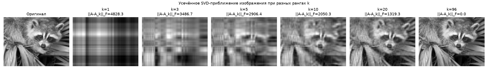
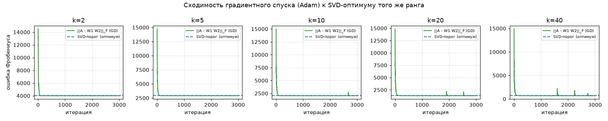
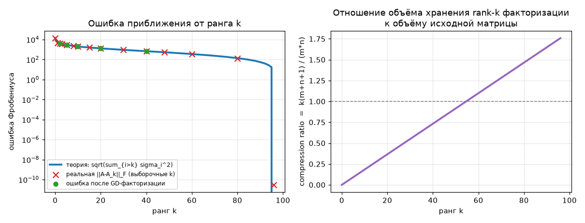

# Теорема Эккарта-Юнга: экспериментальная проверка

Код: [`svd_eckart_young.py`](svd_eckart_young.py) · запуск: `python3 svd_eckart_young.py`
(зависимости: `numpy`, `scipy`, `matplotlib`, опционально `pooch` для загрузки
`scipy.datasets.face`; без него скрипт использует детерминированный
синтетический паттерн). Числа воспроизводятся при фиксированном seed.

## 1. Матрица-"изображение"

Используется `scipy.datasets.face(gray=True)` (768×1024), уменьшенная
усреднением блоков 8×8 до **96×128**, чтобы часть 3 (градиентный спуск)
считалась быстро без потери сути эксперимента.



Видно, что с ростом ранга `k` приближение быстро становится визуально
неотличимым от оригинала — при `k=96` (полный ранг матрицы 96×128) ошибка
приближения равна нулю (в пределах чисел с плавающей точкой).

## 2. Точное совпадение ошибки с теоретической формулой

Для полного SVD `A = U Σ V^T` с сингулярными числами `σ_1 ≥ σ_2 ≥ ... ≥ σ_r`
и усечения `A_k = U_k Σ_k V_k^T` теорема утверждает:

```
||A - A_k||_F = sqrt( Σ_{i>k} σ_i² )
```

Результаты (`results.json`, поле `eckart_young_check`):

| k  | ‖A-A_k‖_F (реальная) | sqrt(Σ_{i>k} σ_i²) (теория) | \|разница\| |
|----|----------------------|------------------------------|-------------|
| 0  | 13771.8134832768 | 13771.8134832768 | 5.5e-12 |
| 1  | 4828.3329216559  | 4828.3329216559  | 1.8e-12 |
| 2  | 4012.0403284456  | 4012.0403284456  | 1.4e-12 |
| 3  | 3486.6687627964  | 3486.6687627964  | 4.5e-13 |
| 5  | 2906.4345985794  | 2906.4345985794  | 4.5e-13 |
| 10 | 2050.3165133128  | 2050.3165133128  | 4.5e-13 |
| 20 | 1319.2824613025  | 1319.2824613025  | 2.3e-13 |
| 40 | 687.2007613711   | 687.2007613711   | 0.0 |
| 80 | 137.6090609035   | 137.6090609035   | 8.5e-14 |
| 96 (полный ранг) | ~0 | 0 | 3.0e-11 |

Максимальное расхождение по всем проверенным `k`: **2.96·10⁻¹¹** — это чистый
шум с плавающей точкой (относительно нормы `‖A‖_F ≈ 1.4·10⁴`), формулы
совпадают **точно**, а не приближённо.

## 3. Оптимальность SVD против обученной факторизации

Берём случайную факторизацию `A ≈ W₁W₂` ранга `k` (`W₁ ∈ R^{m×k}`,
`W₂ ∈ R^{k×n}`, инициализация — гауссов шум, никак не связанный со SVD) и
дообучаем её градиентным спуском (Adam, 3000 итераций) по функции потерь
`‖A - W₁W₂‖_F`. Точный градиент:

```
∂L/∂W₁ = -2(A - W₁W₂)W₂^T,   ∂L/∂W₂ = -2W₁^T(A - W₁W₂),   L = ‖A - W₁W₂‖_F²
```

Результат (`results.json`, поле `gd_vs_svd`):

| k  | SVD-ошибка (оптимум) | Ошибка после GD | GD − SVD |
|----|----------------------|------------------|----------|
| 2  | 4012.040328 | 4012.040328 | +1.4e-12 |
| 5  | 2906.434599 | 2906.434599 | −4.5e-13 |
| 10 | 2050.316513 | 2050.316513 | +9.1e-13 |
| 20 | 1319.282461 | 1319.282461 | +1.3e-09 |
| 40 | 687.200761  | 687.200761  | +1.7e-09 |

Градиентный спуск **сходится вплотную к порогу SVD и никогда не опускается
ниже него** (отклонения — на уровне 10⁻⁹...10⁻¹³, то есть численный шум
оптимизации/floating-point, а не системное преимущество). Это подтверждает
экспериментально: какую бы факторизацию ранга `k` ни искать и как бы её ни
дообучать, ошибку SVD-усечения того же ранга превзойти нельзя.



На графиках видно: кривая обучения GD (зелёная) быстро выходит на
горизонтальную линию SVD-порога (синий пунктир) и остаётся на ней или чуть
выше — но никогда не пересекает её снизу.

## 4. Ошибка и compression ratio от ранга k



- **Слева**: реальная ошибка (красные крестики) точно ложится на
  теоретическую кривую (синяя линия), а ошибки после GD-обучения (зелёные
  точки) — на том же уровне.
- **Справа**: compression ratio определён как отношение объёма хранения
  rank-k факторизации (`U_k`, `Σ_k`, `V_k`: `k·(m+n+1)` чисел) к объёму
  исходной матрицы (`m·n` чисел). Пунктир — уровень 1.0, после которого
  факторизация уже занимает больше памяти, чем исходное изображение
  (для матрицы 96×128 это происходит примерно при `k≈55`, т.е. сжатие имеет
  смысл только для рангов заметно меньше `min(m,n)`).

## Выводы

1. Формула `‖A-A_k‖_F = sqrt(Σ_{i>k} σ_i²)` подтверждена **с точностью до
   floating-point** (максимальное расхождение ~3·10⁻¹¹ при значениях
   порядка 10⁴).
2. Прямая экспериментальная проверка оптимальности: обученная градиентным
   спуском произвольная факторизация ранга `k` не может превзойти ошибку
   SVD-усечения того же ранга — она лишь асимптотически приближается к ней
   снизу-вверх, что и предсказывает теорема Эккарта-Юнга.
